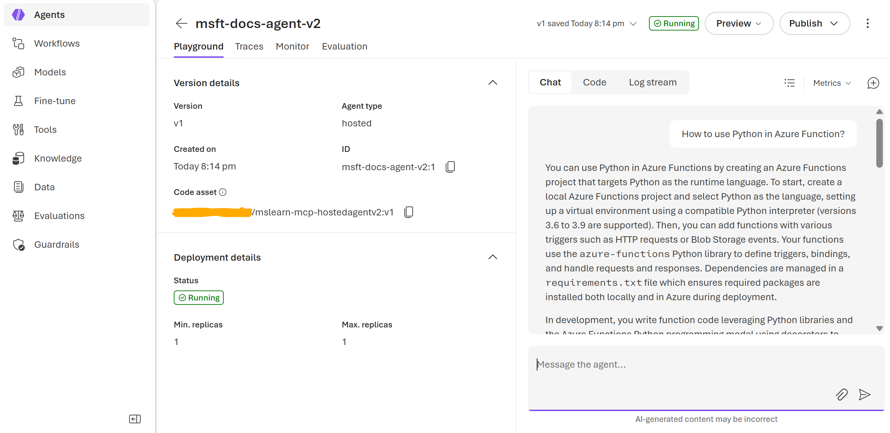

# Azure AI Foundry: Hosted Agent with MCP Tool (Agents v2)

This repo demonstrates the deployment of a **Hosted Agent** to **Microsoft Foundry Agent Service**. The provisoning process setups container ap runtime to host **Microsoft Agent Framework**-based solution and **MCP (Model Context Protocol)** tool integration.

> [!TIP]
> Specifics of Foundry's Hosted Agents is described on this Microsoft Foundry [documentation page](https://learn.microsoft.com/en-us/azure/ai-foundry/agents/how-to/deploy-hosted-agent).

## 📑 Table of Contents:
- [Part 1: Prerequisites](#part-1-prerequisites)
- [Part 2: Environment Setup](#part-2-environment-setup)
- [Part 3: Docker Image](#part-3-docker-image)
- [Part 4: Foundry Deployment](#part-4-foundry-deployment)
- [Part 5: Testing the Agent](#part-5-testing-the-agent)

## Part 1: Prerequisites
Before deploying this solution, ensure you have:

- **Azure Subscription** with access to provision **Azure AI Foundry**,
- **Azure Container Registry (ACR)** instance for the Docker image hosting,
- **Docker Desktop** installed (OPTIONAL - for local builds),
- **Azure CLI** installed locally.

## Part 2: Environment Setup

### 2.1 Azure AI Foundry Setup

Create an Azure AI Foundry **account** and **project** resources and deploy required GPT model (e.g., **gpt-4.1-mini**).

> [!IMPORTANT]
> This solution requires an **Azure AI Foundry Project endpoint**, not an Azure OpenAI endpoint.

| Service          | Endpoint Format                                                      |
| ---------------- | -------------------------------------------------------------------- |
| Azure OpenAI     | `https://<resource>.openai.azure.com/openai/v1/`                     |
| Azure AI Foundry | `https://<resource>.services.ai.azure.com/api/projects/<project-id>` |

### 2.2 Capability Host
Hosted agents require an account-level capability host with public hosting enabled. Create the `capability_host.json` file or re-use the provided one:

``` JSON
{
  "properties": {
    "capabilityHostKind": "Agents",
    "enablePublicHostingEnvironment": true
  }
}
```

Then apply it to your Foundry account:

``` PowerShell
az rest --method put --url "https://management.azure.com/subscriptions/[SUBSCRIPTIONID]/resourceGroups/[RESOURCEGROUPNAME]/providers/Microsoft.CognitiveServices/accounts/[ACCOUNTNAME]/capabilityHosts/accountcaphost?api-version=2025-10-01-preview" --headers "content-type=application/json" --body @capability_host.json
```

Verify the capability host status:

``` PowerShell
az rest --method get --url "https://management.azure.com/subscriptions/[SUBSCRIPTIONID]/resourceGroups/[RESOURCEGROUPNAME]/providers/Microsoft.CognitiveServices/accounts/[ACCOUNTNAME]/capabilityHosts/accountcaphost?api-version=2025-10-01-preview"
```

### 2.3 RBAC Permissions
Assign the following roles to enable the hosted agent to pull from ACR and create agents:

**On Azure Container Registry (ACR)** — assign one of these roles to both Foundry Account and Project managed identities:
- `Container Registry Repository Reader`
- `AcrPull`

**On Foundry Account resource** — assign this role to Foundry Project managed identity:
- `Azure AI User`

### 2.4 Environment Variables

Configure the following environment variables:

| Environment Variable             | Description                                                                                                         |
| -------------------------------- | ------------------------------------------------------------------------------------------------------------------- |
| `AZURE_FOUNDRY_PROJECT_ENDPOINT` | Your Azure AI Foundry Project endpoint (e.g., `https://<resource>.services.ai.azure.com/api/projects/<project-id>`) |
| `AZURE_FOUNDRY_GPT_MODEL`        | The name of your model deployment (e.g., `gpt-4.1-mini`)                                                            |

## Part 3: Docker Image

### 3.1 Build the Image

> [!IMPORTANT]
> Always build for `linux/amd64` platform. Images built on Apple Silicon (ARM64) or other architectures will not work as Hosted Agents.

``` PowerShell
docker build --platform linux/amd64 -t <YOUR_ACR>.azurecr.io/mslearn-mcp-hostedagentv2:v1 .
```

### 3.2 Test the Container Locally

``` PowerShell
docker run --rm -it -e AZURE_FOUNDRY_PROJECT_ENDPOINT="https://<resource>.services.ai.azure.com/api/projects/<project>" -e AZURE_FOUNDRY_GPT_MODEL="gpt-4.1-mini" -p 8088:8088 <ACR>.azurecr.io/mslearn-mcp-hostedagentv2:v1
```

### 3.3 Push to ACR

``` PowerShell
az acr login --name <YOUR_ACR>
docker push <YOUR_ACR>.azurecr.io/mslearn-mcp-hostedagentv2:v1
```

### 3.4 Alternative: Use Pre-built Image from GHCR

If you don't want to build the image locally, import pre-built Docker image from GitHub Container Registry to your ACR:

``` PowerShell
az acr import --name <YOUR_ACR> --source ghcr.io/lazauk/mslearn-mcp-hostedagentv2:v1.0.0 --image mslearn-mcp-hostedagentv2:v1
```

This requires no local Docker installation and copies the image between GitHub and Azure cloud hostings.

## Part 4: Foundry Deployment

### 4.1 Create Hosted Agent Version
Use the provided Jupyter notebook `Foundry_AgentsV2_HostedAgent.ipynb` or run this Python code:

``` Python
from azure.ai.projects import AIProjectClient
from azure.ai.projects.models import HostedAgentDefinition, ProtocolVersionRecord, AgentProtocol
from azure.identity import DefaultAzureCredential

client = AIProjectClient(endpoint=PROJECT_ENDPOINT, credential=DefaultAzureCredential())

agent = client.agents.create_version(
    agent_name="msft-docs-agent-v2",
    definition=HostedAgentDefinition(
        container_protocol_versions=[
            ProtocolVersionRecord(protocol=AgentProtocol.RESPONSES, version="v1")
        ],
        cpu="1",
        memory="2Gi",
        image="[YOUR_ACR].azurecr.io/mslearn-mcp-hostedagentv2:v1",
        environment_variables={
            "AZURE_FOUNDRY_PROJECT_ENDPOINT": PROJECT_ENDPOINT,
            "AZURE_FOUNDRY_GPT_MODEL": MODEL_DEPLOYMENT
        }
    ),
    foundry_features="HostedAgents=V1Preview"
)
```

### 4.2 Start Agent Deployment
Option 1 — Azure Portal:

  <sup>Go to https://ai.azure.com, open your agent and click `Start agent deployment`.</sup>

Option 2 — Azure CLI:

``` PowerShell
az cognitiveservices agent start --account-name [ACCOUNTNAME] --project-name [PROJECTNAME] --name msft-docs-agent-v2 --agent-version 1
```

### 4.3 Publish as Application
In the Azure AI Foundry portal, publish your deployed agent as an Application to get a stable endpoint for testing.

## Part 5: Testing the Agent

### 5.1 Test in Foundry UI

Navigate to your hosted agent in Azure AI Foundry and ask any Azure related questions. The agent should be able to use its MCP tool to retrieve required information from Azure documentation.


